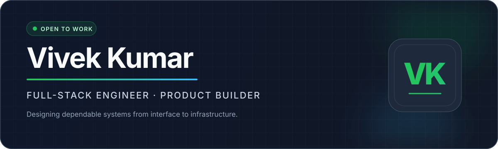

<div align="center">



<h3>Engineering useful products from first commit to production.</h3>

<p>
  <a href="https://portfolio-react-one-orcin.vercel.app"><strong>Portfolio</strong></a>
  &nbsp;·&nbsp;
  <a href="https://www.linkedin.com/in/vivek-kumar-2055211a6"><strong>LinkedIn</strong></a>
  &nbsp;·&nbsp;
  <a href="mailto:vivekkumarprince1@gmail.com"><strong>Email</strong></a>
  &nbsp;·&nbsp;
  <a href="https://leetcode.com/u/q5lq9sHvTw/"><strong>LeetCode</strong></a>
</p>

<p><code>FULL STACK</code> &nbsp; <code>DISTRIBUTED SYSTEMS</code> &nbsp; <code>DEVOPS</code> &nbsp; <code>PRODUCT ENGINEERING</code></p>

</div>

---

## Profile

I'm a Computer Science engineer from **UIET, Panjab University** who builds complete digital products—not isolated demos. My work spans product design, frontend systems, backend architecture, databases, payments, cloud delivery, and production operations.

<table>
<tr>
<td width="25%"><strong>Currently building</strong></td>
<td>FMPG and scalable API infrastructure</td>
</tr>
<tr>
<td><strong>Core strengths</strong></td>
<td>Full-stack delivery, backend systems, DevOps, product ownership</td>
</tr>
<tr>
<td><strong>Learning next</strong></td>
<td>Platform engineering, GitOps, cloud architecture, AI-enabled systems</td>
</tr>
<tr>
<td><strong>Open to</strong></td>
<td>Software engineering roles and ambitious product collaborations</td>
</tr>
</table>

## Featured engineering

<table>
<tr>
<td width="50%" valign="top">

### [wApi](https://github.com/Vivekkumarprince1/wApi)

Production-oriented WhatsApp API platform built as a multi-app, multi-service system.

<code>TypeScript</code> <code>Microservices</code> <code>Docker</code> <code>Kubernetes</code> <code>CI/CD</code>

</td>
<td width="50%" valign="top">

### [FMPG](https://github.com/Vivekkumarprince1/fmpg)

Accommodation discovery and booking platform with customer, owner, payment, and admin workflows.

<code>Node.js</code> <code>Express</code> <code>MongoDB</code> <code>Razorpay</code> <code>Cloudinary</code>

**[Open live product →](https://fmpg.vercel.app)**

</td>
</tr>
<tr>
<td width="50%" valign="top">

### [Career at FMPG](https://github.com/Vivekkumarprince1/career.fmpg)

Focused recruitment experience for discovering opportunities and applying to roles at FMPG.

<code>MongoDB</code> <code>Express</code> <code>React</code> <code>Node.js</code>

**[Open live product →](https://career-fmpg.vercel.app)**

</td>
<td width="50%" valign="top">

### [Vaani](https://github.com/Vivekkumarprince1/vaani)

Full-stack communication product with independently structured client and server applications.

<code>React</code> <code>Node.js</code> <code>Express</code> <code>MongoDB</code>

**[Open live product →](https://react-vaani-frontend.vercel.app)**

</td>
</tr>
</table>

<details>
<summary><strong>More infrastructure work</strong></summary>
<br />

**[ConnectSphere GitOps](https://github.com/Vivekkumarprince1/connectsphere-gitops)** — declarative deployment configuration and environment automation using Kubernetes, Helm, and GitOps workflows.

</details>

## Technical range

| Layer | Tools and technologies |
| :--- | :--- |
| **Languages** | JavaScript · TypeScript · C++ · HTML · CSS |
| **Frontend** | React · Next.js · Tailwind CSS · responsive interfaces |
| **Backend** | Node.js · Express · REST APIs · authentication · payments |
| **Data** | MongoDB · Mongoose · MySQL |
| **Delivery** | Docker · Kubernetes · GitHub Actions · Vercel · AWS · Linux |
| **Workflow** | Git · Postman · Figma · CI/CD · GitOps |

## How I approach engineering

```text
Understand the user → define the system → build the smallest solid version
        → test the critical paths → ship → observe → improve
```

- **Product-aware:** technical decisions begin with the user problem.
- **End-to-end:** I take ownership from interface details to deployment health.
- **Pragmatic:** simple, readable systems come before unnecessary complexity.
- **Production-minded:** security, performance, failure states, and maintainability matter.

---

<div align="center">

### Have a product worth building?

I'm available for software engineering opportunities and focused collaborations.

**[Start a conversation](mailto:vivekkumarprince1@gmail.com)** &nbsp;·&nbsp; **[Connect on LinkedIn](https://www.linkedin.com/in/vivek-kumar-2055211a6)**

<br />

<sub>Designed to stay fast and reliable: no trackers, animated widgets, or third-party stats services.</sub>

</div>
