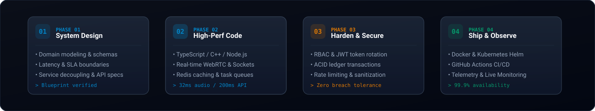

 

<a href="https://portfolio-react-one-orcin.vercel.app"><b>PORTFOLIO</b></a>
&nbsp;&nbsp;&nbsp; / &nbsp;&nbsp;&nbsp;
<a href="https://www.linkedin.com/in/vivek-kumar-2055211a6"><b>LINKEDIN</b></a>
&nbsp;&nbsp;&nbsp; / &nbsp;&nbsp;&nbsp;
<a href="mailto:vivekkumarprince1@gmail.com"><b>EMAIL</b></a>
&nbsp;&nbsp;&nbsp; / &nbsp;&nbsp;&nbsp;
<a href="https://leetcode.com/u/q5lq9sHvTw/"><b>LEETCODE</b></a>

 

## I build the whole product.

Not just the screen. Not just the endpoint. I work across product thinking, interface design, backend architecture, data, integrations, infrastructure, and delivery to turn practical ideas into software people can use.

Based in **Chandigarh, India** · Computer Science, **UIET Panjab University** · Open to **software engineering opportunities**

---

## Selected work

### 01 — [wApi](https://github.com/Vivekkumarprince1/wApi)

**Infrastructure for dependable WhatsApp communication at scale.**

A production-oriented, multi-app and multi-service platform covering APIs, service boundaries, deployment configuration, and operational tooling.

`TypeScript` &nbsp; `Microservices` &nbsp; `Docker` &nbsp; `Kubernetes` &nbsp; `CI/CD`

---

### 02 — [FMPG](https://github.com/Vivekkumarprince1/fmpg) &nbsp;·&nbsp; [LIVE PRODUCT ↗](https://fmpg.vercel.app)

**One platform for discovering, managing, and booking accommodation.**

End-to-end product with customer journeys, property-owner operations, role-based administration, payments, OTP flows, media delivery, analytics, and invoices.

`Node.js` &nbsp; `Express` &nbsp; `MongoDB` &nbsp; `EJS` &nbsp; `Razorpay` &nbsp; `Cloudinary`

---

### 03 — [Career at FMPG](https://github.com/Vivekkumarprince1/career.fmpg) &nbsp;·&nbsp; [LIVE PRODUCT ↗](https://career-fmpg.vercel.app)

**A focused recruitment experience for a growing product company.**

Candidates can discover opportunities and apply through a responsive, purpose-built hiring flow.

`React` &nbsp; `Node.js` &nbsp; `Express` &nbsp; `MongoDB`

---

### 04 — [Vaani](https://github.com/Vivekkumarprince1/vaani) &nbsp;·&nbsp; [LIVE PRODUCT ↗](https://react-vaani-frontend.vercel.app)

**A full-stack communication product with a clean client/server boundary.**

Built as independently structured frontend and backend applications for maintainable iteration and deployment.

`React` &nbsp; `Node.js` &nbsp; `Express` &nbsp; `MongoDB`

<b>05 — ConnectSphere GitOps / infrastructure project</b>

 

[ConnectSphere GitOps](https://github.com/Vivekkumarprince1/connectsphere-gitops) contains declarative environment and deployment configuration built around Kubernetes, Helm, and GitOps workflows.

 

## Capabilities

| 01 / PRODUCT | 02 / APPLICATION | 03 / PLATFORM |
| :--- | :--- | :--- |
| Product thinking | React & Next.js | Docker & Kubernetes |
| Interface design | Node.js & Express | GitHub Actions & CI/CD |
| User journeys | MongoDB & MySQL | AWS, Vercel & Linux |
| Figma & responsive UI | REST APIs & integrations | GitOps & observability |

 

## The way I work

 

I prefer clear requirements, small dependable releases, readable systems, meaningful tests, and feedback from real usage. Security, performance, failure states, and maintainability are product features—not cleanup tasks.

---

## Let's build something useful.

For engineering roles, product collaborations, or an interesting technical conversation:

### [vivekkumarprince1@gmail.com](mailto:vivekkumarprince1@gmail.com)

[LinkedIn](https://www.linkedin.com/in/vivek-kumar-2055211a6) &nbsp;·&nbsp; [Portfolio](https://portfolio-react-one-orcin.vercel.app) &nbsp;·&nbsp; [GitHub](https://github.com/Vivekkumarprince1)

Fast by design. All visual assets live in this repository.

